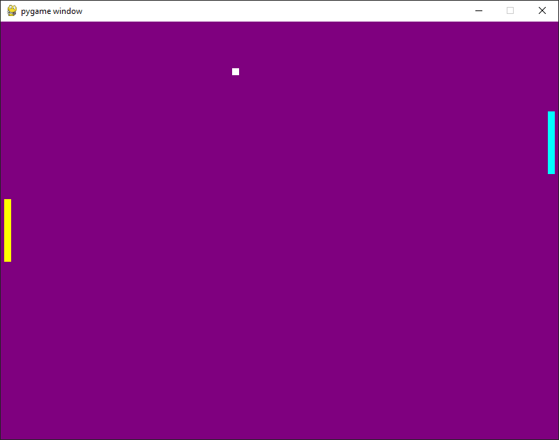

# PygamePong
Simple Pong in pygame

# Program Versions

Made with Windows 10, Python 3.9.12 and Pygame 2.2.0

# Motivation

I chose to implement Pong mostly because of it's simplicity. I found it to be the easiest way of demonstrating the MVC game development model.

# Reasoning

The game is made of 6 classes found in `MVC.py`.

The first 3 are the `RectangleEntity` superclass, the `Puck` class and the `Paddle` class. `Puck` and `Paddle` inherit the `RectangleEntity` class. I chose to do it this way because Pucks and Paddles have different functionality, but are rendered in the exact same way (using the draw.rect() pygame function). All `RectangleEntity` objects have a velocity that is added to their position every frame. If the `Puck` touches the left-most side of the screen, the right-most `Paddle` gets a point and vice-versa.

The `Controller` class checks keys pressed on the keyboard, and if the X button has been hit on the window. These events are converted to booleans which are stored in the controller object for later reference. Ex. If `KEY_UP` is pressed, `player_up` is set to `True`. This was done because 

The `Model` class controls the game state and logic of the entities. First it checks the controller state, and updates the players velocity accordingly. Most game state information is stored within the game Entities, aside from the `score` and `running` boolean which are stored directly in the model object. This makes it convenient and organized to update each objects position and velocity based on their interactions with other entities. I do not have an explicit event queue in the Model class since there are so few events that take place.

The `View` class renders a background color, and then calls each entity's display function.

# Further Work

If I were to enhance this project, I would definitely add sound effects and then add a score display. As of right now, the score is only kept track of in the terminal

## Generalization

This game model could be generalized to any kind of sports game, it would be relatively simple to add more 
interesting physics to the puck (friction, bounce velocity based on the velocity of the paddle) and more interesting movement options to the paddles 
(obstacles, moving left and right, short term speed boosts, etc.), while retaining the general gameplay of trying to move the puck to the opposing side of the screen.
